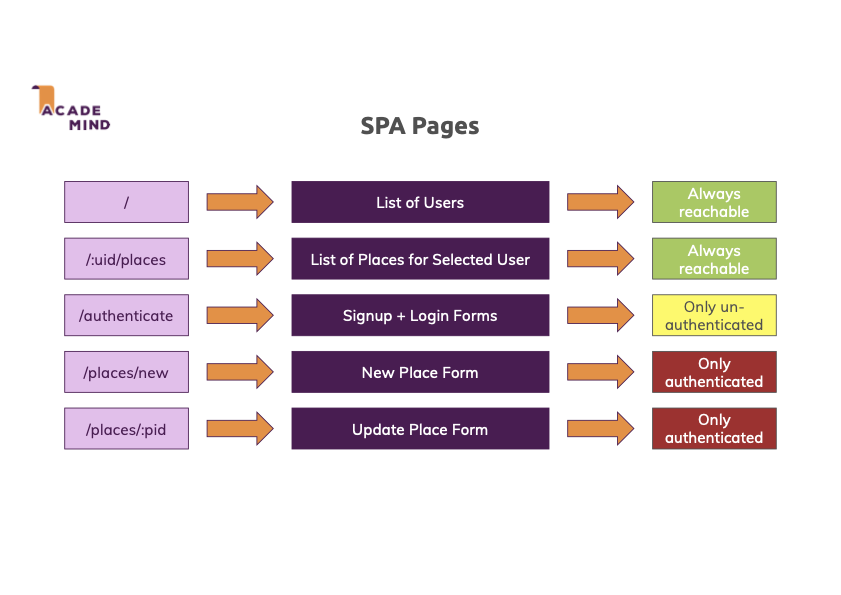
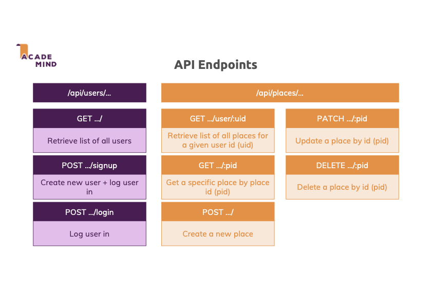

# Place-Sharing Website

## Description

This website allows users to see lists of places visited by other users, as well as detailed information about those places.
Users can also create an account, log in, and cultivate their own places & lists of places.

## Relevant tools & technologies

This project was built using the MERN stack (MongoDB, Express.js, React.js, Node.js) to create a dynamically interactive front end, as well as a fully functional backend utilizing REST api
(React -> Node.js server -> MongoDB server).

I am also proud to say that the front end for this project was entirely built using React Hooks (as opposed to class-components)! React is an exciting library that continues to grow, and i hope to grow along with it :)

Other relevant tools & modules include:
- [Mongoose](https://mongoosejs.com/)
- [react-router-dom v6](https://reactrouter.com/docs/en/v6)
- [body-parser](https://github.com/expressjs/body-parser#readme)
- [express-validator](https://express-validator.github.io/docs/)
- [mongoose-unique-validator](https://github.com/blakehaswell/mongoose-unique-validator#readme)
- [uuidv4](https://github.com/uuidjs/uuid#readme)
- [CSSTransition](http://reactcommunity.org/react-transition-group/css-transition) from react-transition-group
- [React Hooks](https://reactjs.org/docs/hooks-intro.html) (useState, useEffect, useContext, useReducer, useRef)]

## SPA Routes

## REST API Structure

